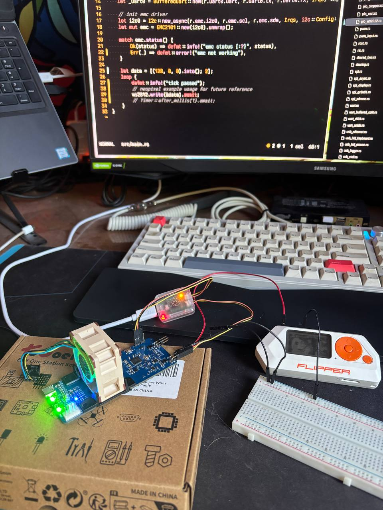
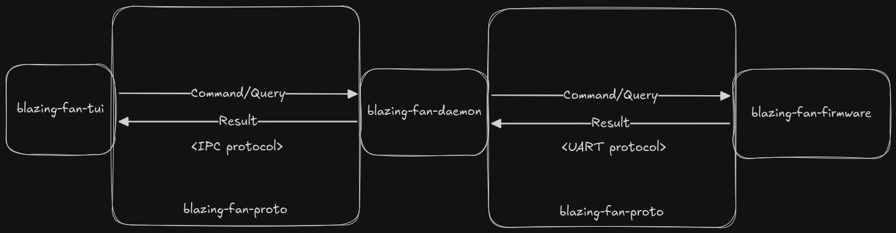
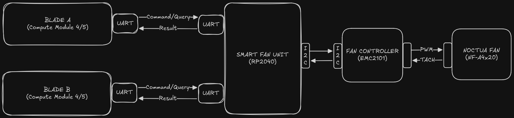

# Preview

## Motivation

Embedded development is my favorite aspect of software engineering because it
allows me not only to write software, but also to physically interact with the
product I am building. For most of my career, I worked as a software engineer
across different domains, but all of those projects were commercial and written
in high-level languages, with little to no direct hardware interaction.

Eventually, I decided that I want to learn embedded programming with Rust and
develop the skills necessary to either find a job in that domain or build my own
product.

Compute Blade is a very young but promising project that allows me to host and
maintain my own cluster of small but efficient servers at home. Since it has its
own fan unit with an RP2040 onboard, I realized that it would be a great
candidate for sharpening my skills and building a cool embedded project around
it. This repository is my attempt to contribute to open source and provide
useful software for controlling fan units and gathering metrics.

# Overview

This repository contains software and firmware that allow you to control and
monitor Compute Blade fan units. The project is written in Rust and based on
Ariel OS.

For now, this is still a work in progress, so stay tuned I plan to deliver the
full chain during 2026.

## High Level Diagrams

# Licensing

The code in this project is licensed under MIT license. Check
 for further details.
